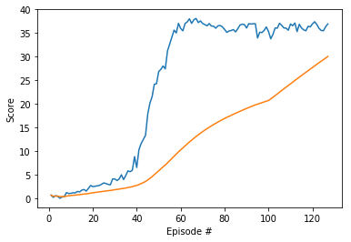
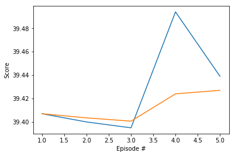

# Report

## Summary

An agent is trained to follow a green mark with the [Reacher](https://github.com/Unity-Technologies/ml-agents/blob/master/docs/Learning-Environment-Examples.md#reacher) environment


In this environment, a double-jointed arm can move to target locations. A reward of +0.1 is provided for each step that the agent's hand is in the goal location. Thus, the goal of your agent is to maintain its position at the target location for as many time steps as possible.

The observation space consists of 33 variables corresponding to position, rotation, velocity, and angular velocities of the arm. Each action is a vector with four numbers, corresponding to torque applicable to two joints. Every entry in the action vector should be a number between -1 and 1.

## Implementation

DDPG algorithm is based on Actor-Critic method. 


Actor and Critic have two network each, local and target for stable learning. It uses a replay buffer to store experience and samples them for learning. After certain steps, Critic local network in evaluated and trained using target network of Actor and Critic. The trained critic is used to get an actor loss adn train the Actor. In the end of the learning step it updates the target networks weights with the local network weights.

Ornstein-Uhlenbeck process provide us with the noise that is add to action for better exploration.


### Model Configuration
#### Actor
| Layer | In | Out
| ----------- | ----------- |----------- |
| Fc1 | state_size | 128
| ReLU | - | -
| Fc2 | 128 | 128
| ReLU | - | -
| Fc3 | 128 | action_size
| tanh | action_size | action_size

#### Critic
| Layer | In | Out
| ----------- | ----------- |----------- |
| Fc1 | state_size | 128
| ReLU | - | -
| Fc2 | 128 + action_size | 128
| ReLU | - | -
| Fc3 | 128 | 1


## Observations

For this environment, the exploration is very important with the use of Noise. Training took very long time at first few days. With proper noise the agent has achieved the score with in 30 min.

## Results
### hyperparameter
```python
BUFFER_SIZE = int(1e5)  # replay buffer size
BATCH_SIZE = 128        # minibatch size
GAMMA = 0.99            # discount factor
TAU = 1e-3              # for soft update of target parameters
LR_ACTOR = 1e-3         # learning rate of the actor 
LR_CRITIC = 1e-3        # learning rate of the critic
WEIGHT_DECAY = 0        # L2 weight decay
UPDATE_EVERY = 1        # update the network after every UPDATE_EVERY timestep
UPDATE_TIMES = 1        # update UPDATE_TIME for every update
EPSILON = 1             # epsilon noise parameter
EPSILON_DECAY = 0       # decay parameter of epsilon
```

### Training 


### Evaluation 


## Future Work
For further improvement following fields could be investigated.

* Noise sampling can be improved 
* [PPO](https://arxiv.org/pdf/1707.06347.pdf), [A3C](https://arxiv.org/pdf/1602.01783.pdf), and [D4PG](https://openreview.net/pdf?id=SyZipzbCb) can be used to check for performance improvement.


## Reference

An Autonomous Path Planning Model for Unmanned Ships Based on Deep Reinforcement Learning - Scientific Figure on ResearchGate. Available from: https://www.researchgate.net/figure/Deep-Deterministic-Policy-Gradient-DDPG-algorithm-structure_fig3_338552761 [accessed 12 Jul, 2020]